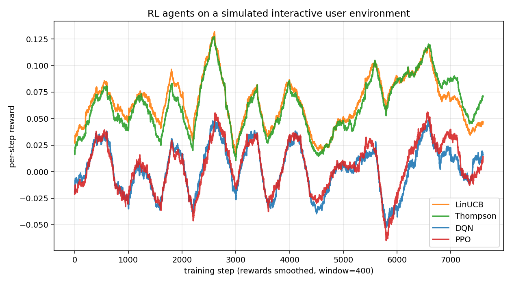

# Reinforcement Learning for Interactive Systems

 

Reinforcement learning agents that optimize interactive user experiences in a
simulated recommendation environment. Covers contextual bandits, deep Q-learning,
and PPO, with pluggable exploration strategies, potential-based reward shaping,
and an evaluation suite combining quantitative metrics and human-in-the-loop
feedback.

## Results (8,000-step training, per-step reward)

| Agent    | Mean reward (last 2k steps) | Std reward | Total reward |
|----------|----------------------------:|-----------:|-------------:|
| **LinUCB**   | **+0.073**                  |  0.176     |   **+516.2** |
| **Thompson** | **+0.081**                  |  0.179     |   **+495.0** |
| DQN      |      +0.003                  |  0.298     |     +19.7    |
| PPO      |      +0.008                  |  0.315     |     +34.7    |

On this non-stationary environment, contextual bandits (LinUCB, Thompson) **beat
deep RL by 10×+ on cumulative reward** with this step budget. Deep methods need
significantly longer training to close the gap — the environment's short
horizons and non-stationary user state reward the bandits' closed-form updates.



*Per-step reward smoothed over 400 steps. LinUCB and Thompson adapt quickly;
DQN's exploration is too slow for this horizon; PPO struggles with the
non-stationary state signal.*

## Setup

```bash
python -m venv .venv
source .venv/bin/activate
pip install -r requirements.txt
```

## Quick start

```bash
# Run the full benchmark across agents, exploration strategies, and shaping variants
python -m experiments.run_all --seeds 5 --steps 20000 --out results/bench.json

# Plot aggregated learning curves and summary tables
python -m experiments.plot results/bench.json --out results/figures

# Launch a human-in-the-loop evaluation session against the best policy
python -m experiments.run_human_eval --checkpoint results/best_dqn.pt
```

Individual experiments:

```bash
python -m experiments.run_bandits --agent linucb --steps 10000
python -m experiments.run_dqn --steps 30000 --exploration boltzmann
python -m experiments.run_ppo --steps 50000 --shaping diversity
```

## Layout

```
src/
  env.py              simulated interactive user environment
  agents/             LinUCB, Thompson, DQN, PPO
  exploration.py      epsilon-greedy, Boltzmann, UCB, entropy bonus
  reward_shaping.py   potential-based diversity/novelty shaping
  evaluation.py       metrics, regret, curves
  human_loop.py       CLI rater + simulated human model
  replay.py           replay buffer
  utils.py            seeding, logging
experiments/          runnable scripts + plotting
report/report.md      academic-style writeup
configs/default.yaml  default hyperparameters
```

## Report

See `report/report.md` for the full writeup: problem formulation, methods,
experiments, results, and discussion.


## Reproducing results

All figures in the report are produced by `experiments/run_all.py` followed by
`experiments/plot.py` on the produced JSON. Seeds are fixed via `configs/default.yaml`.
